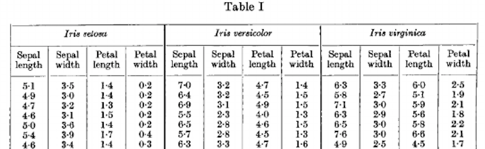
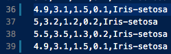
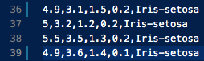

# Pands-project-2021

### Project Introduction

This project was undertaken as part of the Programming and Scripting assessment module, which is a core module in the Higher Diploma in Data Analytics at the Galway-Mayo Institute of Technology. The data researched in this project is the Iris datset. The submission date for this project is the 30th of April, 2021.

#### Project Objectives

Research the data set and write a summary about it.

The project description can be found at the following link: (download pdf, place in same folder & link here)

### Tools used

##### Python 3.7</br>
Python is a widely used programming language, specifically in the world of data science. The language is known for its ease of use, extensive open-source libraries and active community. All of which optimise visualisation, understanding and presentation of data. 

##### Python Libraries</br>
<ul><li>NumPy, Pandas and Matplotlib are some of the most important libraries used in data analysis.

<li>NumPy - a core tool in scientific computing, it allows us to store and manipulate data as multidimensional array objects in Python.

<li>Pandas - for data manipulation and analysis. It reads and writes data while providing data structures (the DataFrame object) and tools for utilising numerical tables in python. 

<li>Matplotlib - The Matplotlib library is used for data visualisation and creating graphical plots in Python and NumPy. Matplotlib is designed in such a way that graphical plots can be created with minimal lines of code.</ul>

##### Visual Studio Code</br>
Also known as VSCode, it is an efficient code editor with convenient tools such as debugging, task running and version-contol. Virtual Studio Code's aim is to facilitate developers with quick and effecient 'code-build-debug cycles'.[1] For this project, VSCode was connected to github for faster, simplified commits to the repository. 

References: </br>
[1] "Visual Studio Code FAQ" Visual Studio, 12 Apr 2021, code.visualstudio.com/docs/supporting/FAQ#:~:text=Visual%20Studio%20Code%20is%20a,such%20as%20Visual%20Studio%20IDE.

### 1.0 Introduction to Fisher’s Iris Data Set
</br>
<p align="center">
    
    <em>Species of Iris flower in data set</em>
</p>

Fisher's Iris data set, also known as the Iris flower data set, is a multivariate collection of data first presented by Ronald Fisher in 1936 in his article *The Use of Multiple Measurements in Taxonomic Problems*.[1] Fisher was a British statistician, geneticist and academic who spearheaded the implementation of statistical methods in the modelling of scientific experiments.[2] For this reason, Fisher has been regarded as “a genius who almost single-handedly created the foundations for modern statistical science”[3] and further, “the single most important figure in 20th century statistics”.[4] 

The Iris data set contains 150 records of individual Iris flowers which were originally collected by Edgar Anderson and for this reason, the data set is sometimes referred to as the Anderson data set.[1] Fisher established a linear algebriac equation to assess whether his samples could be used to classify different Iris species based on the flower's morphology. There were four attributes measured: sepal length, sepal width, petal length and petal width. Fisher observed three seperate species from the sample set: Iris setosa, Iris versicolor and Iris virginica. Below is a preview of Fisher's Iris Data Set.

</br>
*Preview of Fisher's Iris Data Set*

##### Attribute Information
<ol>
<li>sepal length in cm
<li>sepal width in cm
<li>petal length in cm
<li>petal width in cm
<li>class: <ul>
<li>Iris Setosa
<li>Iris Versicolour
<li>Iris Virginica </ul></ol>

References:</br>
[1] Fisher, Ronald A. *"The use of multiple measurements in taxonomic problems."* Annals of eugenics 7.2 (1936): 179-188.</br>
[2] Britannica, The Editors of Encyclopaedia. "Sir Ronald Aylmer Fisher". Encyclopedia Britannica, 13 Feb. 2021, https://www.britannica.com/biography/Ronald-Aylmer-Fisher. Accessed 13 April 2021.</br>
[3] Hald, Anders (1998). *A History of Mathematical Statistics.* New York: Wiley. </br>
[4] Efron, Bradley (1998), "R. A. Fisher in the 21st century", Statistical Science, 13 (2): 95–122, doi:10.1214/ss/1028905930.
### 1.1 Acquiring the data

[Add some basic info about kaggle here]
Dataset obtained from: https://www.kaggle.com/arshid/iris-flower-dataset

#### Correcting the data

It has been noted that some Iris datasets available contain incorrect values.[1] For this reason, the dataset used for this project was cross-referenced with Fisher's original dataset.[2] Any disparities found would need to be corrected so that the current data matched the original. Record numbers 35 and 38 in the original dataset were incongruent with the data in the current dataset. It should be noted that the corresponding rows on the current dataset are 36 and 39, owing to an additional row at index one which specifies the attributes. The error in row 36 was in the fourth value, while there were errors in row 39 in the second and third values. Seen below is the CSV file (containing the Iris dataset) with the incorrect values, followed by the corrected values:

</br>
*Incorrect data*

</br>
*Corrected data*

References: </br>
[1] "Iris Data Set" UCI Machine Learning Repository, 07 Apr. 2021, archive.ics.uci.edu/ml/datasets/iris
[2] Fisher, Ronald A. *"The use of multiple measurements in taxonomic problems."* Annals of eugenics 7.2 (1936): 179-188.
### 1.3 Basic Statistical Analysis:

#### Importing libraries

First, we must import the libraries needed for our analysis. Note: an alias is used for simplification, i.e., pandas is simply referred to as pd. 
```
import pandas as pd
import numpy as np
import matplotlib.pyplot as plt
import seaborn as sns
```
#### Importing the data

Next, we load our IRIS.csv file with pandas.[1] CSV stands for comma-seperated value and this file type is commonly used in data analysis. Pandas is a very useful way to manipulate data and CSV files, while DataFrames are pandas way of storing 2 dimensional data.[2]
```
df = pd.read_csv('IRIS.csv')
```
#### Previewing the data

Simply using the print() function with the name of the DataFrame in the brackets will give a preview of the data, printing the first and last 5 rows of the dataset.
```
print(df)
```
</br>
*The typical appearance of a pandas DataFrame*
#### Acquiring some basic information on the data (Shape, attributes etc.)

The info() function from the pandas library prints a concise summary about the dataframe.[3] It tells us the type of data we are dealing with. The shape of our data is a 2-dimensional array with 150 rows and 5 columns. In Pandas terminology, this type of data is known as a DataFrame. Four of the columns (or atrributes) are of quantitative type: sepal_length, sepal_width, petal_length, petal_width. While one, species, is categorical. The first four attributes are independent variables, while the class label is dependent. We can think of them as having a cause and effect realtionship - the class label is dependent on the value of the attributes. 

Further, it returns the data type of each attribute. The quantitative are all of type float (length and height of sepal or petal) and the categorical is of object type (class: species). This will determine what type of analysis we can perform on the data. Next, it returns the memory usage of the dataset, which is 6.0KB. Finally, we can see that there are no non-null values in our dataset which is significant in that it ensures data integrity and prevents any potentially inaccurate conclusions.

</br>
*Consice summary with pandas*

#### Summary of data

References: 

[1] "Using Pandas and Python to Explore Your Dataset" Reka Horvath, 1 Apr. 2021, https://realpython.com/pandas-python-explore-dataset/
[2] "Python Pandas read_csv – Load Data from CSV Files" Shane Lynn, 6 Apr. 2021, www.shanelynn.ie/python-pandas-read_csv-load-data-from-csv-files/
[3] 4 Apr. 2021, https://pandas.pydata.org/docs/reference/api/pandas.DataFrame.info.html

Other references:
https://support.squarespace.com/hc/en-us/articles/206543587-Markdown-cheat-sheet 