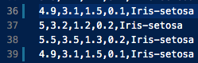
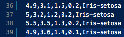
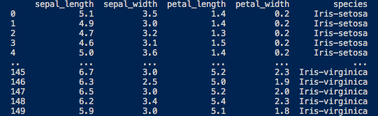
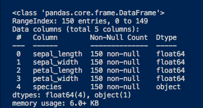

# Pands-project-2021

## Project Introduction <a name="ProjectIntro"></a>

This project was undertaken as part of the Programming and Scripting assessment module, which is a core module in the Higher Diploma in Data Analytics at the Galway-Mayo Institute of Technology. The data researched in this project is the Iris datset. The submission date is the 30th of April, 2021.

Many thanks to lecturer Andrew Beatty for a thoroughly informative and enjoyable module.

### Table of Contents
* [Project Objectives](#Objectives)
    * [Tools used](#Tools)
* [1.0 Introduction to Fisher’s Iris Data Set](#FisherIntro)
    * [Attribute Information](#Attributes)
* [1.1 Acquiring the data](#1.1)
    * [Correcting the data](#Correct)
* [1.2 Basic Statistical Analysis](#Basic)
    * [Importing libraries](#Libraries)
    * [Importing the data](#Import)
    * [Previewing the data](#Preview)
    * [The basics (Shape, attributes etc.)](#TheBasics)
    * [Describing the data](#Describe)
    * [Graphical Summary - Box & Violin Plots](#Graphical)
* [2.0 Analysing the data](#Analysis)

### Project Objectives <a name="Objectives"></a>

<ol><li>Research the data set and write a summary about it.
<li>Write a program called analysis.py that:
<ul><li>outputs a summary of each variable to a single text file
<li>saves a histogram of each variable to png files, and
<li>outputs a scatter plot of each pair of variables.</ul>
<li>Use screenshots and images to explain your workings.
<li>Explain what tools are used in your analysis and how you implemented them.
<li>Discuss compelling examples of how others have analysed the data set
<li>Write a conclusion with your findings and insights.
</ol>

<em>The project description can be found [here](./pdfs/Project_2021_description.pdf).</em>

### Tools used <a name="Tools"></a>

##### Python 3.7</br>
Python is a widely used programming language, specifically in the world of data science. The language is known for its ease of use, extensive open-source libraries and active community. All of which optimise visualisation, understanding and presentation of data. 

##### Python Libraries</br>
<ul><li>NumPy, Pandas and Matplotlib are some of the most important libraries used in data analysis.

<li>NumPy - a core tool in scientific computing, it allows us to store and manipulate data as multidimensional array objects in Python.

<li>Pandas - for data manipulation and analysis. It reads and writes data while providing data structures (the DataFrame object) and tools for utilising numerical tables in python. 

<li>Matplotlib - is used for data visualisation and creating graphical plots in Python and NumPy. Matplotlib is designed in such a way that graphical plots can be created with minimal lines of code.

<li>Seaborn - is based on matplotlib and is a data visualisation library known for providing 'a high-level interface for drawing attractive and informative statistical graphics'. [1]</ul>

##### Visual Studio Code</br>
Also known as VSCode, it is an efficient code editor with convenient tools such as debugging, task running and version-contol. Virtual Studio Code's aim is to facilitate developers with quick and effecient 'code-build-debug cycles'. [2] For this project, VSCode was connected to github for faster, simplified commits to the repository. 

References:</br>

[1] "seaborn: statistical data visualisation" Seaborn, 22 Apr. 2021, https://seaborn.pydata.org/#:~:text=Seaborn%20is%20a%20Python%20data,attractive%20and%20informative%20statistical%20graphics.</br>
[2] "Visual Studio Code FAQ" Visual Studio, 12 Apr 2021, https://code.visualstudio.com/docs/supporting/FAQ#:~:text=Visual%20Studio%20Code%20is%20a,such%20as%20Visual%20Studio%20IDE.

## 1.0 Introduction to Fisher’s Iris Data Set <a name="FisherIntro"></a>

</br>
<p align="center">
     </br>
    <em>Species of Iris flower in data set</em>
</p>

Fisher's Iris data set, also known as the Iris flower data set, is a multivariate collection of data first presented by Ronald Fisher in 1936 in his article *The Use of Multiple Measurements in Taxonomic Problems*. [1] Fisher was a British statistician, geneticist and academic who spearheaded the implementation of statistical methods in the modelling of scientific experiments. [2] For this reason, Fisher has been regarded as “a genius who almost single-handedly created the foundations for modern statistical science”[3] and further, “the single most important figure in 20th century statistics”. [4] 

The Iris data set contains 150 records of individual Iris flowers which were originally collected by Edgar Anderson and for this reason, the data set is sometimes referred to as the Anderson data set. [1] Fisher established a linear algebriac equation to assess whether his samples could be used to classify different Iris species based on the flower's morphology. There were four attributes measured: sepal length, sepal width, petal length and petal width. Fisher observed three seperate species from the sample set: Iris setosa, Iris versicolor and Iris virginica. Below is a preview of Fisher's Iris Data Set. The full original data set can be found [here](./pngs/Fisher's_og_data.png).

</br>
*Preview of Fisher's Iris Data Set*

#### Attribute Information <a name="Attributes"></a>
<ol>
<li>sepal length in cm
<li>sepal width in cm
<li>petal length in cm
<li>petal width in cm
<li>class: <ul>
<li>Iris Setosa
<li>Iris Versicolour
<li>Iris Virginica </ul></ol>

References:</br>

[1] Fisher, Ronald A. *"The use of multiple measurements in taxonomic problems."* Annals of eugenics 7.2 (1936): 179-188.</br>
[2] Britannica, The Editors of Encyclopaedia. "Sir Ronald Aylmer Fisher". Encyclopedia Britannica, 13 Feb. 2021, https://www.britannica.com/biography/Ronald-Aylmer-Fisher. Accessed 13 April 2021.</br>
[3] Hald, Anders (1998). *A History of Mathematical Statistics.* New York: Wiley. </br>
[4] Efron, Bradley (1998), "R. A. Fisher in the 21st century", Statistical Science, 13 (2): 95–122, doi:10.1214/ss/1028905930.
### 1.1 Acquiring the data <a name="1.1"></a>

The Iris data set that will be studied in this project was obtained from Kaggle. [1] Kaggle is an online machine learning environment and data science community. [2] It offers competitions in machine learning, datasets and access to educational content. The data sets are published by users and are then available for others to use freely. Data sets are scored by users for their usability. The chosen data set chosen for this project had had a usability score of 8.2, which was deemed as satisfactory.

#### Correcting the data <a name="Correct"></a>

It has been noted that some Iris datasets available contain incorrect values. [3] For this reason, the dataset used for this project was cross-referenced with Fisher's original dataset. [4] Any disparities were corrected so that the current data matched the original. Record numbers 35 and 38 in the original dataset were incongruent with the data in the current dataset. It should be noted that the corresponding rows on the current dataset are 36 and 39, owing to an additional row at index one which specifies the attributes. The error in row 36 was in the fourth value, while there were errors in row 39 in the second and third values. Seen below is the CSV file (containing the Iris dataset) with the incorrect values, followed by the corrected values:

</br>
*Incorrect data*
</br>
</br>
*Corrected data*

References:</br>

[1] "Iris Flower Dataset" MathNerd, 1 Apr. 2021, https://www.kaggle.com/arshid/iris-flower-dataset </br>
[2] "Getting Started" Zeeshan-ul-hassan Usmani, 22 Apr. 2021, https://www.kaggle.com/getting-started/44916
[3] "Iris Data Set" UCI Machine Learning Repository, 07 Apr. 2021, https://archive.ics.uci.edu/ml/datasets/iris </br>
[4] Fisher, Ronald A. *"The use of multiple measurements in taxonomic problems."* Annals of eugenics 7.2 (1936): 179-188.
### 1.2 Basic Statistical Analysis <a name="Basic"></a>

#### Importing libraries <a name="Libraries"></a>

First, we must import the libraries needed for our analysis. Note: an alias is used for simplification, i.e., pandas is simply referred to as pd. 
```
import pandas as pd
import numpy as np
import matplotlib.pyplot as plt
import seaborn as sns
```
#### Importing the data <a name="Import"></a>

Next, we load our IRIS.csv file with pandas. [1] CSV stands for comma-seperated value and this file type is commonly used in data analysis. Pandas is a very useful way to manipulate data and CSV files, while DataFrames are pandas way of storing 2 dimensional data. [2] The DataFrame is assigned to the variable 'df' for future reference and use. 
```
df = pd.read_csv('IRIS.csv')
```
#### Previewing the data <a name="Preview"></a>

Simply using the print() function with the name of the DataFrame in the brackets will give a preview of the data, printing the first and last 5 rows of the dataset. This gives an initial "feel" for the data and the values contained in the set. 
```
print(df)
```
</br>
*The typical appearance of a pandas DataFrame*
#### The basics (Shape, attributes, counts etc.) <a name="TheBasics"></a>

The info() method prints a concise summary of the dataframe. [3] It tells us the type of data we are dealing with. The shape of our data is a 2-dimensional array with 150 rows and 5 columns. In Pandas terminology, this type of data is known as a DataFrame. Four of the columns (or atrributes) are of quantitative type: sepal_length, sepal_width, petal_length, petal_width. While one, species, is categorical. The first four attributes are independent variables, while the class label is dependent. We can think of them as having a cause and effect realtionship - the class label is dependent on the value of the attributes. 

Further, it returns the data type of each attribute. The quantitative are all of type float (length and height of sepal or petal) and the categorical is of object type (class: species). This will determine what type of analysis we can perform on the data. Next, it returns the memory usage of the dataset, which is 6.0KB. Finally, we can see that there are no non-null values in our data set which is significant in that it ensures data integrity and prevents any potentially inaccurate conclusions.
```
df.info()
```
</br>
*Consice summary with pandas*

Another useful tool when checking data is getting a count of occurances of a unique value. In our case, it would be beneficial to know the count of each species in the data set. The value_counts() method from the pandas library returns the frequency of unique values in a specified column in descending order, where the first element returned has the highest amount of instances. [4] 
```
print(df['species'].value_counts()) 
print(df['species'].value_counts(normalize=True, dropna=False)*100)
```
.png "Counts")</br>
*Count & percentage of each species*
#### Describing the data <a name="Describe"></a>

The describe() function, from the pandas library, outputs a basic statistical summary of the columns in our DataFrame, grouping them by the 'species' attribute. [5] Specifically, this method returns the: count, mean (or average), standard deviation, minimum value, lower quartile (25th percentile), median (50th percentile), upper quartile (75 percentile) and maximum value. This type of analysis is univariate as we are only observing the values of individual attributes and not the relationship between them. The following screenshots is the output of the describe() method on our data:
```
describe(df)
```
1.png "Describing the data")</br>
*Describing the data using the describe() function fig.1*

2.png "Describing the data")</br>
*Describing the data using the describe() function fig.2*

#### Graphical summary - Box plots & Violin plots <a name="Graphical"></a>

To visualise the spread of the data, a box plot graph can be useful. Using pyplot and seaborn to create the plot, the same data is displayed as the screenshots above, however, a box plot visualisation gives an intuitive depiction of the data and is specifically uselful for identifying outliers. Box plots deal with quantiative (numerical) data and split the data into quartiles. [6] The box shape indicates the first (Q1) to third quartile (Q3) and the horizontal line in the middle of the box (Q2) indicates the median of our data. The vertical lines stemming from the top and bottom of the boxes are called whiskers. The whiskers extend to indicate the lowest and highest non-outlier values in our data set, while the isolated points indicate the outliers.
```
def boxAll():
    sns.set(style="ticks") 
    plt.figure(figsize = (12,10))
    plt.subplot(2,2,1)
    sns.boxplot(x='species',y ='sepal_length',data=df)
    plt.subplot(2,2,2)
    sns.boxplot(x='species',y='sepal_width',data=df)
    plt.subplot(2,2,3)
    sns.boxplot(x='species',y='petal_length',data=df)
    plt.subplot(2,2,4)
    sns.boxplot(x='species',y='petal_width',data=df)
    plt.show()
```
</br>
*Box plots for each variable*


An important piece of information that the box plot provides is the number of outliers in the data. There are not many which denotes no significant impact on our analysis. Another useful observation from the box plot above is the clear difference in size and form between the Iris-setosa and the other two species. The setosa has smaller petals and proportionally wider sepals than the versicolor and virginica. While box plots provides some general information about the distribution of our data, it lacks specificity. Violin plots display the distribution of data at each point on the plot, providing a more in-depth picture of our data. 
```
def allViolin():
    sns.set(style="whitegrid")
    plt.figure(figsize=(12,10))
    plt.subplot(2,2,1)
    sns.violinplot(x='species',y='sepal_length',data=df)
    plt.subplot(2,2,2)
    sns.violinplot(x='species',y='sepal_width',data=df)
    plt.subplot(2,2,3)
    sns.violinplot(x='species',y='petal_length',data=df)
    plt.subplot(2,2,4)
    sns.violinplot(x='species',y='petal_width',data=df)
    plt.show()
```
</br>
*Violin plot for each variable*

With the violin plots we can see the structure of the data. The added density information allows us to observe, for example, that the Iris-setosa values are concentrated closer to the median. Meaning, the Iris-setosa values are less spread out than the other species in regard to sepal-length, petal-length and petal-width, while there is considerable overlap of those values between the Iris-versicolor and the Iris-virginica. Now that a summary of the data set is completed and we have a general 'feel' for the data, it is time for the analysis. 

References: 

[1] "Using Pandas and Python to Explore Your Dataset" Reka Horvath, 1 Apr. 2021, https://realpython.com/pandas-python-explore-dataset/
[2] "Python Pandas read_csv – Load Data from CSV Files" Shane Lynn, 6 Apr. 2021, www.shanelynn.ie/python-pandas-read_csv-load-data-from-csv-files/
[3] 4 Apr. 2021, https://pandas.pydata.org/docs/reference/api/pandas.DataFrame.info.html
[4] "pandas.Series.value_counts" pandas, 23 Apr. 2021, https://pandas.pydata.org/pandas-docs/stable/reference/api/pandas.Series.value_counts.html
[5] "pandas.DataFrame.describe" 18 Apr. 2021https://pandas.pydata.org/docs/reference/api/pandas.DataFrame.describe.html
Other references:
https://support.squarespace.com/hc/en-us/articles/206543587-Markdown-cheat-sheet 
[6] "Boxplots" Stat Trek, 19 Apr. 2021, https://stattrek.com/statistics/charts/boxplot.aspx#:~:text=If%20you%20are%20interested%20in,largest%20value%2C%20including%20any%20outliers.&text=The%20middle%20half%20of%20a%20data%20set%20falls%20within%20the%20interquartile%20range.

### 2.0 Analysing the data <a name="Analysis"></a>

#### Histogram with density plot

```
def hist():
    # plots sepal length values
    sns.FacetGrid(df,hue="species",height=7).map(sns.distplot,"sepal_length").add_legend(fontsize=12)   # increased legend fontsize
    plt.savefig('pngs/distinctHist_sepal_length')
    # plots sepal width values
    sns.FacetGrid(df,hue="species",height=7).map(sns.distplot,"sepal_width").add_legend(fontsize=12)
    plt.savefig('pngs/distinctHist_sepal_width')
    # plots petal length values
    sns.FacetGrid(df,hue="species",height=7).map(sns.distplot,"petal_length").add_legend(fontsize=12)
    plt.savefig('pngs/distinctHist_petal_length')
    # plots petal width values
    sns.FacetGrid(df,hue="species",height=7).map(sns.distplot,"petal_width").add_legend(fontsize=12)
    # saves pngs of plots in pngs folder
    plt.savefig('pngs/distinctHist_petal_width') 
    # matplotlib opens 4 seperate windows displaying the plots just created
    plt.show() 
```

</br>
*Sepal Length Histogram & Density Plot*

</br>
*Sepal Width Histogram & Density Plot*

</br>
*Petal Length Histogram & Density Plot*

</br>
*Petal Width Histogram & Density Plot*

#### Pair scatter plot